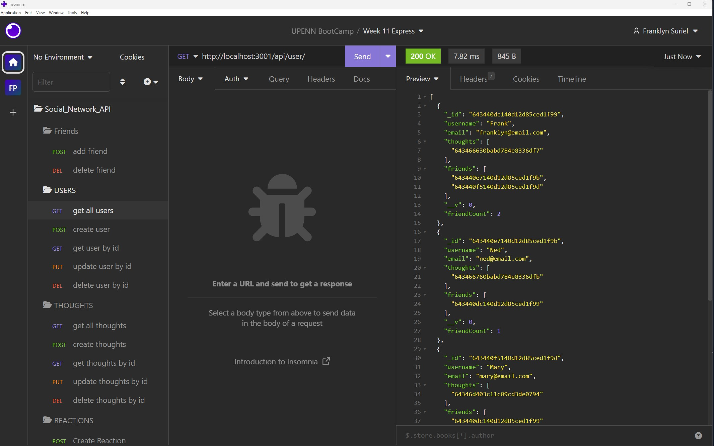

# Social_Network_API

## Description

A social network API to make friends, share the thoughts and react to them., and create a list of your friends.

## Table of Contents

  - [Installation](#Installation)
  - [Usage](#Usage)
  - [License](#License)
  - [Contributions](#Contributions)
  - [Test](#Test)
  - [Questions](#Questions)

## Installation
 
This application requires the following packages:
- [nodejs](https://nodejs.org/en/)
- [express](https://www.npmjs.com/package/express)
- [mongoose](https://www.npmjs.com/package/mongoose)
- [nodemon](https://www.npmjs.com/package/nodemon)

## Usage

Because this is an API we will need to use Insomnia to create a run the different routes. When navigating to route **/api/user/** you can get a list of all user or you can use post to create a neu user. Navigate to route **/api/user/:userId** allow you to get an user, update an user or delete an user by its id. When navigating to **// /api/user/:userId/friends/:friendId** you can add a new friend to the friend list or delete a friend from the friend list. You also can navigate to **/api/thoughts/** to get a list of all created thoughts or you can create a new thought. Navigating to  **/api/thoughts/:thoughtId**  allow you to get a single thought, update a thought or delete a thought by its id. The route **// /api/thought/:thoughtId/reactions** allow you to create a reaction for a thought, and the route **// /api/thought/:thoughtId/reactions/:reactionId** allow you to delete a thought by its id.

Github repository site here: [https://github.com/FranklynSuriel/Social_Network_API](https://github.com/FranklynSuriel/Social_Network_API)

## Credits

Documentation(s) and webpage(s):

- W3 Schools
- mongoose
- express
- Stack Overflow

U. Penn Bootcamp instructor(s):

- Andrew Hojnowski

## License

This project is licensed under the MIT license.

## Contributing

No contributions guidelines.

## Test

No test available.

## Questions

[github.com/FranklynSuriel](https://github.com/FranklynSuriel)

Questions about this project or to report an issue can be sent to:
fsuriel@gmail.com. Please specify the name of the project in the subject of the email.